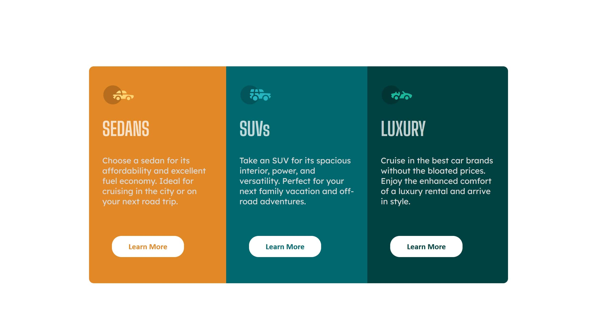

# Frontend Mentor - 3-column preview card component solution

This is a solution to the [3-column preview card component challenge on Frontend Mentor](https://www.frontendmentor.io/challenges/3column-preview-card-component-pH92eAR2-). Frontend Mentor challenges help you improve your coding skills by building realistic projects. 

## Table of contents

- [Overview](#overview)
  - [The challenge](#the-challenge)
  - [Screenshot](#screenshot)
  - [Links](#links)
- [My process](#my-process)
  - [Built with](#built-with)
  - [What I learned](#what-i-learned)
  - [Continued development](#continued-development)
- [Author](#author)

## Overview

### The challenge

Users should be able to view 3 cards side by side in 1 row.

### Screenshot

### Links

- Solution URL: https://your-solution-url.com
- Live Site URL: https://v102002.github.io/3-card-component/

## My process

### Built with

- Semantic HTML5 markup
- CSS custom properties
- Flexbox

### What I learned
I revised on using necessary CSS commands. I tried to use CSS whereever it was necessary in this challenge.

### Continued development

I will continue to write cleaner and concise CSS to make it readable.

## Author
- Frontend Mentor - [@V102002](https://www.frontendmentor.io/profile/V102002)

